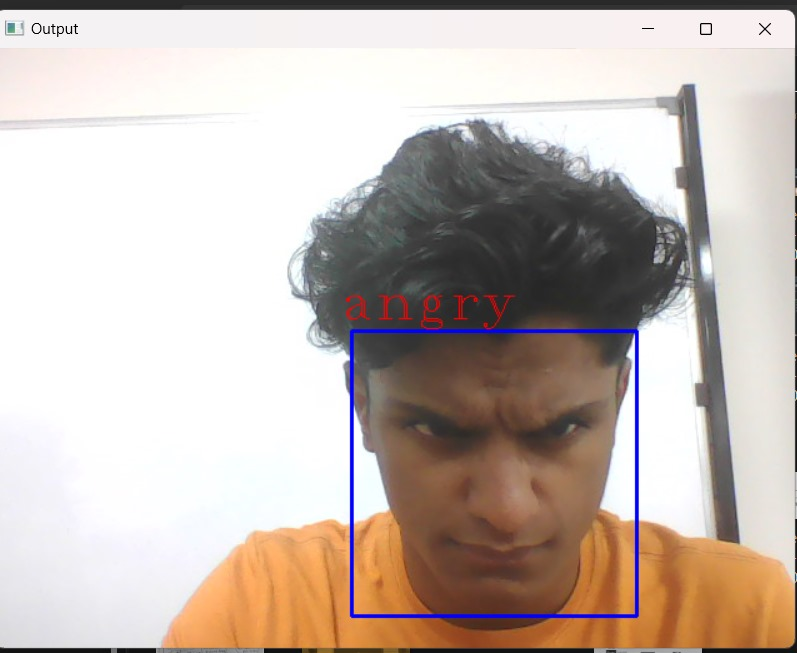
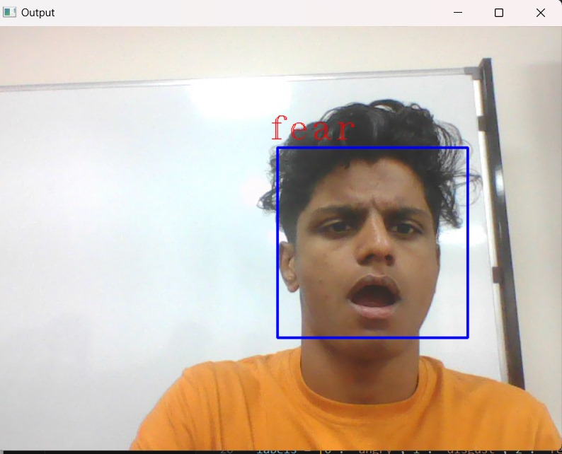
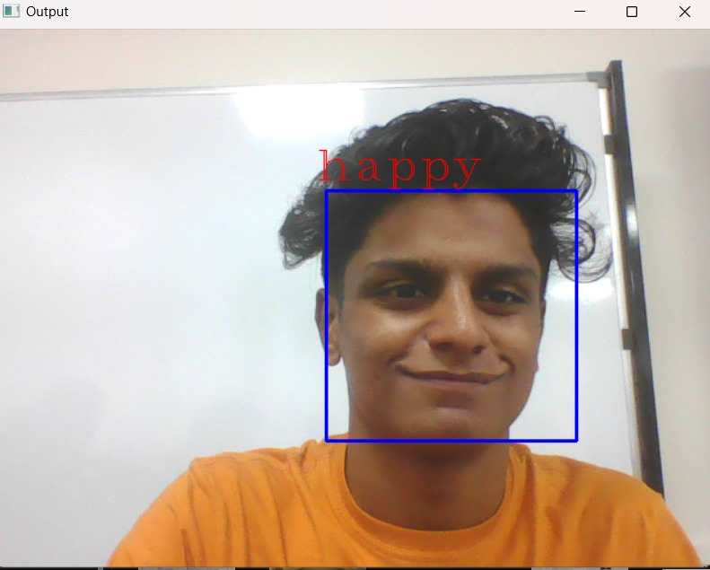
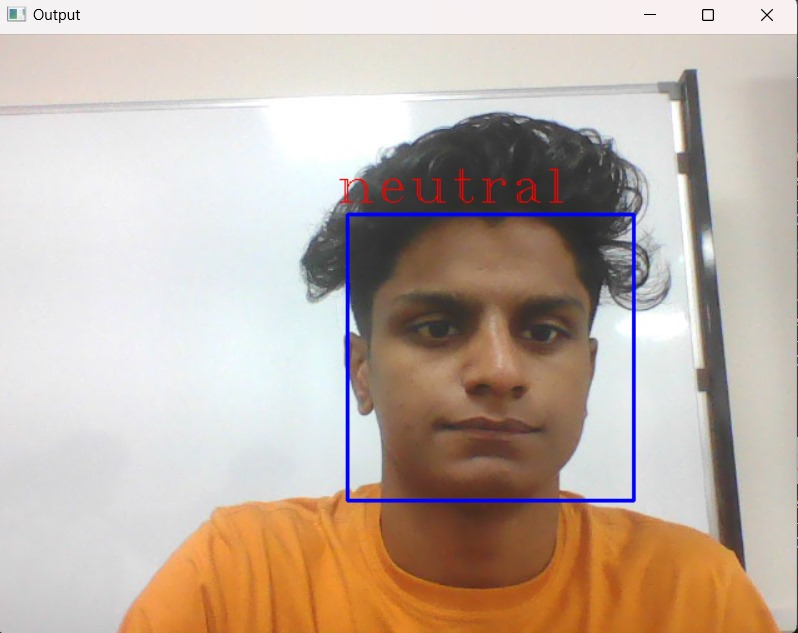
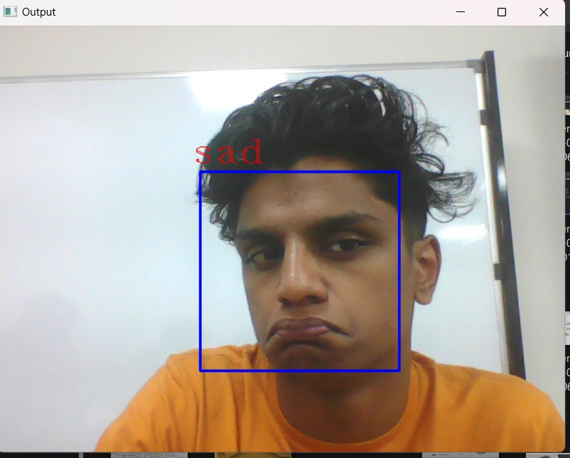

# 😊 Face Emotion Recognition System

## 📷 Sample Output

<p align="center">
  
  
  
  
  
  
</p>

---

## 📌 Features

- Detects faces from live webcam feed using OpenCV.
- Classifies facial emotions using a CNN model.
- Supports multiple emotion classes: Happy, Sad, Angry, Surprise, Neutral, etc.
- Real-time video inference and display.
- Easy-to-use interface and modular code.

---

## 🛠️ Tech Stack

- **Frontend**: OpenCV (live video feed)
- **Backend**: Python
- **ML/DL Frameworks**: TensorFlow, Keras
- **Model**: Convolutional Neural Network (CNN)
- **Others**: NumPy, Matplotlib, Jupyter, Haarcascade

---

## 📂 Project Structure

```
FaceEmotionRecognition/
├── FaceEmotionModel.ipynb         # Jupyter notebook for model training and testing
├── facialemotionmodel.h5          # Trained CNN model weights
├── facialemotionmodel.json        # Model architecture in JSON
├── realtimedetection.py           # Real-time emotion detection script
├── Requirements.txt               # Python dependencies
├── images/
│   ├── train/                     # Training images (by emotion)
│   └── test/                      # Test images (by emotion)
└── README.md
```

---

## 📈 Dataset Used

- **FER-2013**: Facial Expression Recognition dataset containing grayscale images categorized into various emotions.
- Download from: https://www.kaggle.com/datasets/msambare/fer2013

---

## 🚀 Getting Started

### 1. Clone the Repository

```bash
git clone https://github.com/junaid11P/FaceEmotionRecognition.git
cd FaceEmotionRecognition
```

### 2. Install Dependencies

```bash
pip install -r Requirements.txt
```

### 3. Run the Application

```bash
python realtimedetection.py
```

A webcam window will open and start detecting your emotion in real-time.

---

## 🧠 Training the Model (Optional)

Open `FaceEmotionModel.ipynb` in Jupyter Notebook to train or retrain the model.  
Ensure you have the FER2013 dataset placed in the correct directory and preprocessed.

---

## ✍️ Authors

* [Juned](https://github.com/junaid11P)
* Contributors welcome via pull requests!

---

